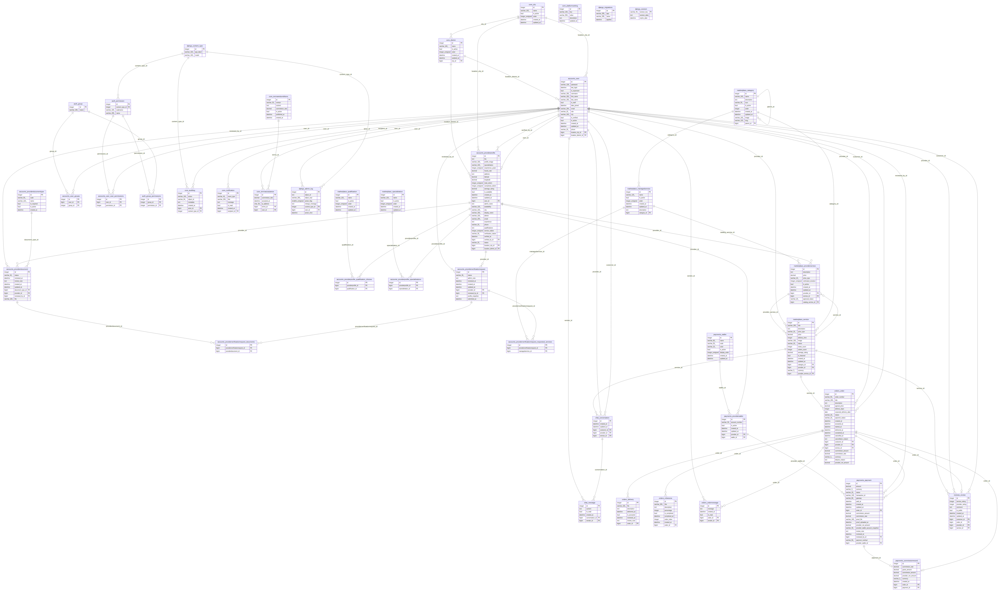
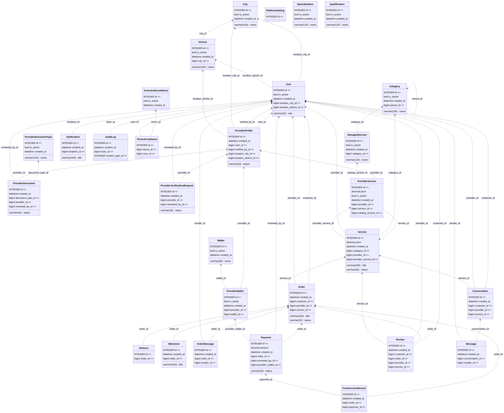
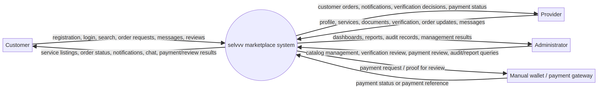
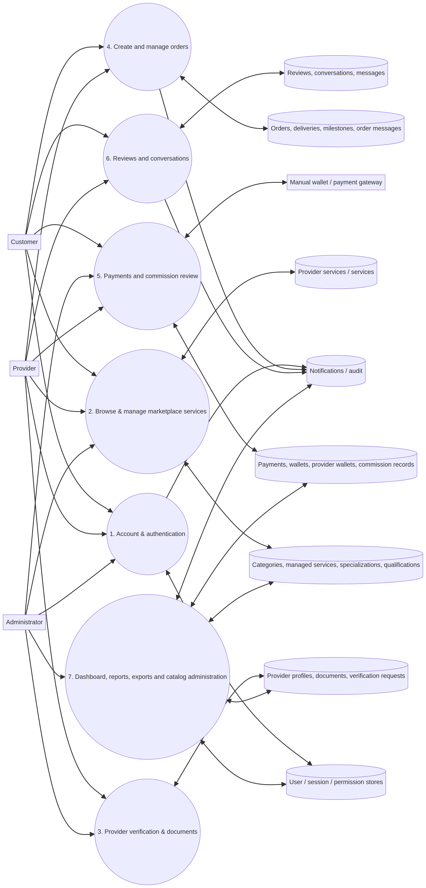
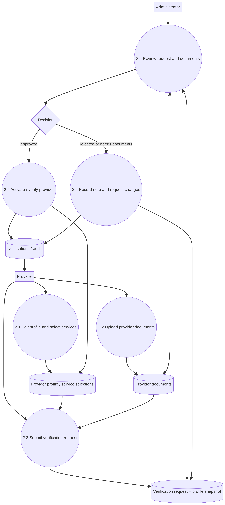
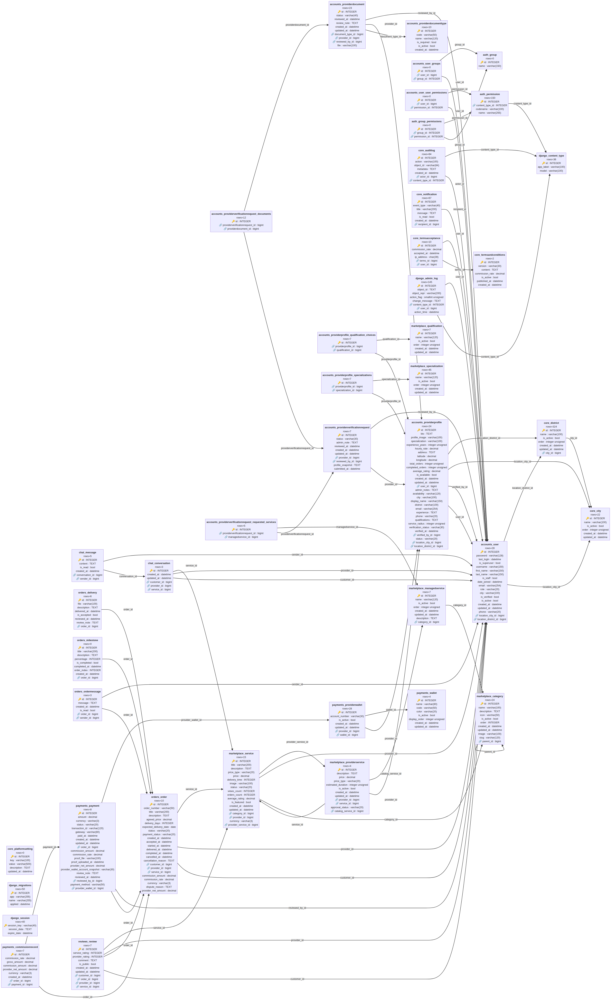

# تحليل قاعدة البيانات ومخططات نظام selvvv

> أُنجز هذا التقرير اعتمادًا على الفحص المباشر للملف `db.sqlite3` وعلى ملفات النماذج والمسارات والخدمات الموجودة في المستودع. لا تُعامل أي علاقة غير مُعلنة كمفتاح أجنبي رسمي.

## 1. Database Analysis

### ملخص الفحص

| البند | النتيجة الفعلية |
|---|---:|
| إصدار SQLite | `3.45.1` |
| عدد الجداول | **42** |
| عدد العروض Views | **0** |
| عدد المشغلات Triggers | **0** |
| مجموع السجلات في الجداول | **1,216** |
| عدد المفاتيح الأجنبية المعلنة | **65** |
| حالة `PRAGMA foreign_keys` أثناء الفحص | **0 (غير مفعّلة على اتصال الفحص)** |

### جرد الجداول والحقول

يعرض الجدول التالي كل جدول كما ظهر في `sqlite_master`، مع جميع الحقول ونوع كل حقل. تشير `PK` إلى المفتاح الأساسي، وتشير `FK` إلى أن الحقل جزء من مفتاح أجنبي معلن في SQLite.

#### `accounts_providerdocument` — 23 سجل

| الحقل | النوع | PK | FK | إلزامي |
|---|---|---:|---:|---:|
| `id` | `INTEGER` | نعم | — | نعم |
| `status` | `varchar(40)` | لا | — | نعم |
| `reviewed_at` | `datetime` | لا | — | لا |
| `review_note` | `TEXT` | لا | — | نعم |
| `created_at` | `datetime` | لا | — | نعم |
| `updated_at` | `datetime` | لا | — | نعم |
| `document_type_id` | `bigint` | لا | `accounts_providerdocumenttype.id` | نعم |
| `provider_id` | `bigint` | لا | `accounts_providerprofile.id` | نعم |
| `reviewed_by_id` | `bigint` | لا | `accounts_user.id` | لا |
| `file` | `varchar(100)` | لا | — | نعم |

#### `accounts_providerdocumenttype` — 10 سجل

| الحقل | النوع | PK | FK | إلزامي |
|---|---|---:|---:|---:|
| `id` | `INTEGER` | نعم | — | نعم |
| `code` | `varchar(50)` | لا | — | نعم |
| `name` | `varchar(120)` | لا | — | نعم |
| `is_required` | `bool` | لا | — | نعم |
| `is_active` | `bool` | لا | — | نعم |
| `created_at` | `datetime` | لا | — | نعم |

#### `accounts_providerprofile` — 24 سجل

| الحقل | النوع | PK | FK | إلزامي |
|---|---|---:|---:|---:|
| `id` | `INTEGER` | نعم | — | نعم |
| `bio` | `TEXT` | لا | — | نعم |
| `profile_image` | `varchar(100)` | لا | — | لا |
| `specialization` | `varchar(100)` | لا | — | نعم |
| `experience_years` | `integer unsigned` | لا | — | نعم |
| `hourly_rate` | `decimal` | لا | — | لا |
| `address` | `TEXT` | لا | — | نعم |
| `latitude` | `decimal` | لا | — | لا |
| `longitude` | `decimal` | لا | — | لا |
| `total_orders` | `integer unsigned` | لا | — | نعم |
| `completed_orders` | `integer unsigned` | لا | — | نعم |
| `average_rating` | `decimal` | لا | — | نعم |
| `is_available` | `bool` | لا | — | نعم |
| `created_at` | `datetime` | لا | — | نعم |
| `updated_at` | `datetime` | لا | — | نعم |
| `user_id` | `bigint` | لا | `accounts_user.id` | نعم |
| `admin_notes` | `TEXT` | لا | — | نعم |
| `availability` | `varchar(120)` | لا | — | نعم |
| `city` | `varchar(100)` | لا | — | نعم |
| `display_name` | `varchar(150)` | لا | — | نعم |
| `district` | `varchar(100)` | لا | — | نعم |
| `email` | `varchar(254)` | لا | — | نعم |
| `experience` | `TEXT` | لا | — | نعم |
| `phone` | `varchar(20)` | لا | — | نعم |
| `qualifications` | `TEXT` | لا | — | نعم |
| `service_radius` | `integer unsigned` | لا | — | نعم |
| `verification_status` | `varchar(30)` | لا | — | نعم |
| `verified_at` | `datetime` | لا | — | لا |
| `verified_by_id` | `bigint` | لا | `accounts_user.id` | لا |
| `status` | `varchar(20)` | لا | — | نعم |
| `location_city_id` | `bigint` | لا | `core_city.id` | لا |
| `location_district_id` | `bigint` | لا | `core_district.id` | لا |

#### `accounts_providerprofile_qualification_choices` — 7 سجل

| الحقل | النوع | PK | FK | إلزامي |
|---|---|---:|---:|---:|
| `id` | `INTEGER` | نعم | — | نعم |
| `providerprofile_id` | `bigint` | لا | `accounts_providerprofile.id` | نعم |
| `qualification_id` | `bigint` | لا | `marketplace_qualification.id` | نعم |

#### `accounts_providerprofile_specializations` — 7 سجل

| الحقل | النوع | PK | FK | إلزامي |
|---|---|---:|---:|---:|
| `id` | `INTEGER` | نعم | — | نعم |
| `providerprofile_id` | `bigint` | لا | `accounts_providerprofile.id` | نعم |
| `specialization_id` | `bigint` | لا | `marketplace_specialization.id` | نعم |

#### `accounts_providerverificationrequest` — 7 سجل

| الحقل | النوع | PK | FK | إلزامي |
|---|---|---:|---:|---:|
| `id` | `INTEGER` | نعم | — | نعم |
| `status` | `varchar(30)` | لا | — | نعم |
| `admin_note` | `TEXT` | لا | — | نعم |
| `reviewed_at` | `datetime` | لا | — | لا |
| `created_at` | `datetime` | لا | — | نعم |
| `updated_at` | `datetime` | لا | — | نعم |
| `provider_id` | `bigint` | لا | `accounts_providerprofile.id` | نعم |
| `reviewed_by_id` | `bigint` | لا | `accounts_user.id` | لا |
| `profile_snapshot` | `TEXT` | لا | — | نعم |
| `submitted_at` | `datetime` | لا | — | لا |

#### `accounts_providerverificationrequest_documents` — 12 سجل

| الحقل | النوع | PK | FK | إلزامي |
|---|---|---:|---:|---:|
| `id` | `INTEGER` | نعم | — | نعم |
| `providerverificationrequest_id` | `bigint` | لا | `accounts_providerverificationrequest.id` | نعم |
| `providerdocument_id` | `bigint` | لا | `accounts_providerdocument.id` | نعم |

#### `accounts_providerverificationrequest_requested_services` — 5 سجل

| الحقل | النوع | PK | FK | إلزامي |
|---|---|---:|---:|---:|
| `id` | `INTEGER` | نعم | — | نعم |
| `providerverificationrequest_id` | `bigint` | لا | `accounts_providerverificationrequest.id` | نعم |
| `managedservice_id` | `bigint` | لا | `marketplace_managedservice.id` | نعم |

#### `accounts_user` — 28 سجل

| الحقل | النوع | PK | FK | إلزامي |
|---|---|---:|---:|---:|
| `id` | `INTEGER` | نعم | — | نعم |
| `password` | `varchar(128)` | لا | — | نعم |
| `last_login` | `datetime` | لا | — | لا |
| `is_superuser` | `bool` | لا | — | نعم |
| `username` | `varchar(150)` | لا | — | نعم |
| `first_name` | `varchar(150)` | لا | — | نعم |
| `last_name` | `varchar(150)` | لا | — | نعم |
| `is_staff` | `bool` | لا | — | نعم |
| `date_joined` | `datetime` | لا | — | نعم |
| `email` | `varchar(254)` | لا | — | نعم |
| `role` | `varchar(20)` | لا | — | نعم |
| `city` | `varchar(100)` | لا | — | نعم |
| `is_verified` | `bool` | لا | — | نعم |
| `is_active` | `bool` | لا | — | نعم |
| `created_at` | `datetime` | لا | — | نعم |
| `updated_at` | `datetime` | لا | — | نعم |
| `phone` | `varchar(20)` | لا | — | نعم |
| `location_city_id` | `bigint` | لا | `core_city.id` | لا |
| `location_district_id` | `bigint` | لا | `core_district.id` | لا |

#### `accounts_user_groups` — 0 سجل

| الحقل | النوع | PK | FK | إلزامي |
|---|---|---:|---:|---:|
| `id` | `INTEGER` | نعم | — | نعم |
| `user_id` | `bigint` | لا | `accounts_user.id` | نعم |
| `group_id` | `INTEGER` | لا | `auth_group.id` | نعم |

#### `accounts_user_user_permissions` — 0 سجل

| الحقل | النوع | PK | FK | إلزامي |
|---|---|---:|---:|---:|
| `id` | `INTEGER` | نعم | — | نعم |
| `user_id` | `bigint` | لا | `accounts_user.id` | نعم |
| `permission_id` | `INTEGER` | لا | `auth_permission.id` | نعم |

#### `auth_group` — 0 سجل

| الحقل | النوع | PK | FK | إلزامي |
|---|---|---:|---:|---:|
| `id` | `INTEGER` | نعم | — | نعم |
| `name` | `varchar(150)` | لا | — | نعم |

#### `auth_group_permissions` — 0 سجل

| الحقل | النوع | PK | FK | إلزامي |
|---|---|---:|---:|---:|
| `id` | `INTEGER` | نعم | — | نعم |
| `group_id` | `INTEGER` | لا | `auth_group.id` | نعم |
| `permission_id` | `INTEGER` | لا | `auth_permission.id` | نعم |

#### `auth_permission` — 150 سجل

| الحقل | النوع | PK | FK | إلزامي |
|---|---|---:|---:|---:|
| `id` | `INTEGER` | نعم | — | نعم |
| `content_type_id` | `INTEGER` | لا | `django_content_type.id` | نعم |
| `codename` | `varchar(100)` | لا | — | نعم |
| `name` | `varchar(255)` | لا | — | نعم |

#### `chat_conversation` — 3 سجل

| الحقل | النوع | PK | FK | إلزامي |
|---|---|---:|---:|---:|
| `id` | `INTEGER` | نعم | — | نعم |
| `created_at` | `datetime` | لا | — | نعم |
| `updated_at` | `datetime` | لا | — | نعم |
| `customer_id` | `bigint` | لا | `accounts_user.id` | نعم |
| `provider_id` | `bigint` | لا | `accounts_user.id` | نعم |
| `service_id` | `bigint` | لا | `marketplace_service.id` | لا |

#### `chat_message` — 5 سجل

| الحقل | النوع | PK | FK | إلزامي |
|---|---|---:|---:|---:|
| `id` | `INTEGER` | نعم | — | نعم |
| `content` | `TEXT` | لا | — | نعم |
| `is_read` | `bool` | لا | — | نعم |
| `created_at` | `datetime` | لا | — | نعم |
| `conversation_id` | `bigint` | لا | `chat_conversation.id` | نعم |
| `sender_id` | `bigint` | لا | `accounts_user.id` | نعم |

#### `core_auditlog` — 64 سجل

| الحقل | النوع | PK | FK | إلزامي |
|---|---|---:|---:|---:|
| `id` | `INTEGER` | نعم | — | نعم |
| `action` | `varchar(100)` | لا | — | نعم |
| `object_id` | `varchar(64)` | لا | — | نعم |
| `metadata` | `TEXT` | لا | — | نعم |
| `created_at` | `datetime` | لا | — | نعم |
| `actor_id` | `bigint` | لا | `accounts_user.id` | لا |
| `content_type_id` | `INTEGER` | لا | `django_content_type.id` | لا |

#### `core_city` — 22 سجل

| الحقل | النوع | PK | FK | إلزامي |
|---|---|---:|---:|---:|
| `id` | `INTEGER` | نعم | — | نعم |
| `name` | `varchar(100)` | لا | — | نعم |
| `is_active` | `bool` | لا | — | نعم |
| `order` | `integer unsigned` | لا | — | نعم |
| `created_at` | `datetime` | لا | — | نعم |
| `updated_at` | `datetime` | لا | — | نعم |

#### `core_district` — 324 سجل

| الحقل | النوع | PK | FK | إلزامي |
|---|---|---:|---:|---:|
| `id` | `INTEGER` | نعم | — | نعم |
| `name` | `varchar(100)` | لا | — | نعم |
| `is_active` | `bool` | لا | — | نعم |
| `order` | `integer unsigned` | لا | — | نعم |
| `created_at` | `datetime` | لا | — | نعم |
| `updated_at` | `datetime` | لا | — | نعم |
| `city_id` | `bigint` | لا | `core_city.id` | نعم |

#### `core_notification` — 67 سجل

| الحقل | النوع | PK | FK | إلزامي |
|---|---|---:|---:|---:|
| `id` | `INTEGER` | نعم | — | نعم |
| `event_type` | `varchar(40)` | لا | — | نعم |
| `title` | `varchar(200)` | لا | — | نعم |
| `message` | `TEXT` | لا | — | نعم |
| `is_read` | `bool` | لا | — | نعم |
| `created_at` | `datetime` | لا | — | نعم |
| `recipient_id` | `bigint` | لا | `accounts_user.id` | نعم |

#### `core_platformsetting` — 0 سجل

| الحقل | النوع | PK | FK | إلزامي |
|---|---|---:|---:|---:|
| `id` | `INTEGER` | نعم | — | نعم |
| `key` | `varchar(100)` | لا | — | نعم |
| `value` | `varchar(500)` | لا | — | نعم |
| `description` | `TEXT` | لا | — | نعم |
| `updated_at` | `datetime` | لا | — | نعم |

#### `core_termsacceptance` — 10 سجل

| الحقل | النوع | PK | FK | إلزامي |
|---|---|---:|---:|---:|
| `id` | `INTEGER` | نعم | — | نعم |
| `commission_rate` | `decimal` | لا | — | نعم |
| `accepted_at` | `datetime` | لا | — | نعم |
| `ip_address` | `char(39)` | لا | — | لا |
| `terms_id` | `bigint` | لا | `core_termsandconditions.id` | نعم |
| `user_id` | `bigint` | لا | `accounts_user.id` | نعم |

#### `core_termsandconditions` — 2 سجل

| الحقل | النوع | PK | FK | إلزامي |
|---|---|---:|---:|---:|
| `id` | `INTEGER` | نعم | — | نعم |
| `version` | `varchar(30)` | لا | — | نعم |
| `content` | `TEXT` | لا | — | نعم |
| `commission_rate` | `decimal` | لا | — | نعم |
| `is_active` | `bool` | لا | — | نعم |
| `published_at` | `datetime` | لا | — | لا |
| `created_at` | `datetime` | لا | — | نعم |

#### `django_admin_log` — 145 سجل

| الحقل | النوع | PK | FK | إلزامي |
|---|---|---:|---:|---:|
| `id` | `INTEGER` | نعم | — | نعم |
| `object_id` | `TEXT` | لا | — | لا |
| `object_repr` | `varchar(200)` | لا | — | نعم |
| `action_flag` | `smallint unsigned` | لا | — | نعم |
| `change_message` | `TEXT` | لا | — | نعم |
| `content_type_id` | `INTEGER` | لا | `django_content_type.id` | لا |
| `user_id` | `bigint` | لا | `accounts_user.id` | نعم |
| `action_time` | `datetime` | لا | — | نعم |

#### `django_content_type` — 36 سجل

| الحقل | النوع | PK | FK | إلزامي |
|---|---|---:|---:|---:|
| `id` | `INTEGER` | نعم | — | نعم |
| `app_label` | `varchar(100)` | لا | — | نعم |
| `model` | `varchar(100)` | لا | — | نعم |

#### `django_migrations` — 50 سجل

| الحقل | النوع | PK | FK | إلزامي |
|---|---|---:|---:|---:|
| `id` | `INTEGER` | نعم | — | نعم |
| `app` | `varchar(255)` | لا | — | نعم |
| `name` | `varchar(255)` | لا | — | نعم |
| `applied` | `datetime` | لا | — | نعم |

#### `django_session` — 40 سجل

| الحقل | النوع | PK | FK | إلزامي |
|---|---|---:|---:|---:|
| `session_key` | `varchar(40)` | نعم | — | نعم |
| `session_data` | `TEXT` | لا | — | نعم |
| `expire_date` | `datetime` | لا | — | نعم |

#### `marketplace_category` — 24 سجل

| الحقل | النوع | PK | FK | إلزامي |
|---|---|---:|---:|---:|
| `id` | `INTEGER` | نعم | — | نعم |
| `name` | `varchar(100)` | لا | — | نعم |
| `description` | `TEXT` | لا | — | نعم |
| `icon` | `varchar(50)` | لا | — | نعم |
| `is_active` | `bool` | لا | — | نعم |
| `order` | `INTEGER` | لا | — | نعم |
| `created_at` | `datetime` | لا | — | نعم |
| `updated_at` | `datetime` | لا | — | نعم |
| `image` | `varchar(100)` | لا | — | لا |
| `slug` | `varchar(120)` | لا | — | لا |
| `parent_id` | `bigint` | لا | `marketplace_category.id` | لا |

#### `marketplace_managedservice` — 7 سجل

| الحقل | النوع | PK | FK | إلزامي |
|---|---|---:|---:|---:|
| `id` | `INTEGER` | نعم | — | نعم |
| `name` | `varchar(120)` | لا | — | نعم |
| `is_active` | `bool` | لا | — | نعم |
| `order` | `integer unsigned` | لا | — | نعم |
| `created_at` | `datetime` | لا | — | نعم |
| `updated_at` | `datetime` | لا | — | نعم |
| `description` | `TEXT` | لا | — | نعم |
| `category_id` | `bigint` | لا | `marketplace_category.id` | لا |

#### `marketplace_providerservice` — 4 سجل

| الحقل | النوع | PK | FK | إلزامي |
|---|---|---:|---:|---:|
| `id` | `INTEGER` | نعم | — | نعم |
| `description` | `TEXT` | لا | — | نعم |
| `price` | `decimal` | لا | — | نعم |
| `price_type` | `varchar(20)` | لا | — | نعم |
| `estimated_duration` | `integer unsigned` | لا | — | نعم |
| `is_active` | `bool` | لا | — | نعم |
| `created_at` | `datetime` | لا | — | نعم |
| `updated_at` | `datetime` | لا | — | نعم |
| `provider_id` | `bigint` | لا | `accounts_providerprofile.id` | نعم |
| `service_id` | `bigint` | لا | `marketplace_service.id` | لا |
| `approval_status` | `varchar(20)` | لا | — | نعم |
| `catalog_service_id` | `bigint` | لا | `marketplace_managedservice.id` | لا |

#### `marketplace_qualification` — 7 سجل

| الحقل | النوع | PK | FK | إلزامي |
|---|---|---:|---:|---:|
| `id` | `INTEGER` | نعم | — | نعم |
| `name` | `varchar(120)` | لا | — | نعم |
| `is_active` | `bool` | لا | — | نعم |
| `order` | `integer unsigned` | لا | — | نعم |
| `created_at` | `datetime` | لا | — | نعم |
| `updated_at` | `datetime` | لا | — | نعم |

#### `marketplace_service` — 15 سجل

| الحقل | النوع | PK | FK | إلزامي |
|---|---|---:|---:|---:|
| `id` | `INTEGER` | نعم | — | نعم |
| `title` | `varchar(200)` | لا | — | نعم |
| `description` | `TEXT` | لا | — | نعم |
| `price_type` | `varchar(20)` | لا | — | نعم |
| `price` | `decimal` | لا | — | لا |
| `delivery_time` | `INTEGER` | لا | — | نعم |
| `image` | `varchar(100)` | لا | — | لا |
| `status` | `varchar(20)` | لا | — | نعم |
| `views_count` | `INTEGER` | لا | — | نعم |
| `orders_count` | `INTEGER` | لا | — | نعم |
| `average_rating` | `decimal` | لا | — | نعم |
| `is_featured` | `bool` | لا | — | نعم |
| `created_at` | `datetime` | لا | — | نعم |
| `updated_at` | `datetime` | لا | — | نعم |
| `category_id` | `bigint` | لا | `marketplace_category.id` | لا |
| `provider_id` | `bigint` | لا | `accounts_user.id` | نعم |
| `currency` | `varchar(3)` | لا | — | نعم |
| `provider_service_id` | `bigint` | لا | `marketplace_providerservice.id` | لا |

#### `marketplace_specialization` — 45 سجل

| الحقل | النوع | PK | FK | إلزامي |
|---|---|---:|---:|---:|
| `id` | `INTEGER` | نعم | — | نعم |
| `name` | `varchar(120)` | لا | — | نعم |
| `is_active` | `bool` | لا | — | نعم |
| `order` | `integer unsigned` | لا | — | نعم |
| `created_at` | `datetime` | لا | — | نعم |
| `updated_at` | `datetime` | لا | — | نعم |

#### `orders_delivery` — 6 سجل

| الحقل | النوع | PK | FK | إلزامي |
|---|---|---:|---:|---:|
| `id` | `INTEGER` | نعم | — | نعم |
| `file` | `varchar(100)` | لا | — | نعم |
| `description` | `TEXT` | لا | — | نعم |
| `delivered_at` | `datetime` | لا | — | نعم |
| `is_accepted` | `bool` | لا | — | نعم |
| `reviewed_at` | `datetime` | لا | — | لا |
| `review_note` | `TEXT` | لا | — | نعم |
| `order_id` | `bigint` | لا | `orders_order.id` | نعم |

#### `orders_milestone` — 0 سجل

| الحقل | النوع | PK | FK | إلزامي |
|---|---|---:|---:|---:|
| `id` | `INTEGER` | نعم | — | نعم |
| `title` | `varchar(200)` | لا | — | نعم |
| `description` | `TEXT` | لا | — | نعم |
| `percentage` | `INTEGER` | لا | — | نعم |
| `is_completed` | `bool` | لا | — | نعم |
| `completed_at` | `datetime` | لا | — | لا |
| `order_index` | `INTEGER` | لا | — | نعم |
| `created_at` | `datetime` | لا | — | نعم |
| `order_id` | `bigint` | لا | `orders_order.id` | نعم |

#### `orders_order` — 10 سجل

| الحقل | النوع | PK | FK | إلزامي |
|---|---|---:|---:|---:|
| `id` | `INTEGER` | نعم | — | نعم |
| `order_number` | `varchar(50)` | لا | — | نعم |
| `title` | `varchar(200)` | لا | — | نعم |
| `description` | `TEXT` | لا | — | نعم |
| `agreed_price` | `decimal` | لا | — | نعم |
| `delivery_days` | `INTEGER` | لا | — | نعم |
| `expected_delivery_date` | `date` | لا | — | لا |
| `status` | `varchar(20)` | لا | — | نعم |
| `payment_status` | `varchar(20)` | لا | — | نعم |
| `created_at` | `datetime` | لا | — | نعم |
| `accepted_at` | `datetime` | لا | — | لا |
| `started_at` | `datetime` | لا | — | لا |
| `delivered_at` | `datetime` | لا | — | لا |
| `completed_at` | `datetime` | لا | — | لا |
| `cancelled_at` | `datetime` | لا | — | لا |
| `cancellation_reason` | `TEXT` | لا | — | نعم |
| `customer_id` | `bigint` | لا | `accounts_user.id` | نعم |
| `provider_id` | `bigint` | لا | `accounts_user.id` | نعم |
| `service_id` | `bigint` | لا | `marketplace_service.id` | لا |
| `commission_amount` | `decimal` | لا | — | لا |
| `commission_rate` | `decimal` | لا | — | لا |
| `currency` | `varchar(3)` | لا | — | نعم |
| `dispute_reason` | `TEXT` | لا | — | نعم |
| `provider_net_amount` | `decimal` | لا | — | لا |

#### `orders_ordermessage` — 3 سجل

| الحقل | النوع | PK | FK | إلزامي |
|---|---|---:|---:|---:|
| `id` | `INTEGER` | نعم | — | نعم |
| `message` | `TEXT` | لا | — | نعم |
| `created_at` | `datetime` | لا | — | نعم |
| `is_read` | `bool` | لا | — | نعم |
| `order_id` | `bigint` | لا | `orders_order.id` | نعم |
| `sender_id` | `bigint` | لا | `accounts_user.id` | نعم |

#### `payments_commissionrecord` — 7 سجل

| الحقل | النوع | PK | FK | إلزامي |
|---|---|---:|---:|---:|
| `id` | `INTEGER` | نعم | — | نعم |
| `commission_rate` | `decimal` | لا | — | نعم |
| `gross_amount` | `decimal` | لا | — | نعم |
| `commission_amount` | `decimal` | لا | — | نعم |
| `provider_net_amount` | `decimal` | لا | — | نعم |
| `currency` | `varchar(3)` | لا | — | نعم |
| `created_at` | `datetime` | لا | — | نعم |
| `order_id` | `bigint` | لا | `orders_order.id` | نعم |
| `payment_id` | `bigint` | لا | `payments_payment.id` | لا |

#### `payments_payment` — 8 سجل

| الحقل | النوع | PK | FK | إلزامي |
|---|---|---:|---:|---:|
| `id` | `INTEGER` | نعم | — | نعم |
| `amount` | `decimal` | لا | — | نعم |
| `currency` | `varchar(3)` | لا | — | نعم |
| `status` | `varchar(20)` | لا | — | نعم |
| `transaction_id` | `varchar(120)` | لا | — | نعم |
| `gateway` | `varchar(80)` | لا | — | نعم |
| `paid_at` | `datetime` | لا | — | لا |
| `created_at` | `datetime` | لا | — | نعم |
| `updated_at` | `datetime` | لا | — | نعم |
| `order_id` | `bigint` | لا | `orders_order.id` | نعم |
| `commission_amount` | `decimal` | لا | — | لا |
| `commission_rate` | `decimal` | لا | — | لا |
| `proof_file` | `varchar(100)` | لا | — | لا |
| `proof_uploaded_at` | `datetime` | لا | — | لا |
| `provider_net_amount` | `decimal` | لا | — | لا |
| `provider_wallet_account_snapshot` | `varchar(30)` | لا | — | نعم |
| `review_note` | `TEXT` | لا | — | نعم |
| `reviewed_at` | `datetime` | لا | — | لا |
| `reviewed_by_id` | `bigint` | لا | `accounts_user.id` | لا |
| `payment_method` | `varchar(50)` | لا | — | نعم |
| `provider_wallet_id` | `bigint` | لا | `payments_providerwallet.id` | لا |

#### `payments_providerwallet` — 28 سجل

| الحقل | النوع | PK | FK | إلزامي |
|---|---|---:|---:|---:|
| `id` | `INTEGER` | نعم | — | نعم |
| `account_number` | `varchar(30)` | لا | — | نعم |
| `is_active` | `bool` | لا | — | نعم |
| `created_at` | `datetime` | لا | — | نعم |
| `updated_at` | `datetime` | لا | — | نعم |
| `provider_id` | `bigint` | لا | `accounts_providerprofile.id` | نعم |
| `wallet_id` | `bigint` | لا | `payments_wallet.id` | نعم |

#### `payments_wallet` — 4 سجل

| الحقل | النوع | PK | FK | إلزامي |
|---|---|---:|---:|---:|
| `id` | `INTEGER` | نعم | — | نعم |
| `name` | `varchar(80)` | لا | — | نعم |
| `code` | `varchar(50)` | لا | — | نعم |
| `color` | `varchar(20)` | لا | — | نعم |
| `is_active` | `bool` | لا | — | نعم |
| `display_order` | `integer unsigned` | لا | — | نعم |
| `created_at` | `datetime` | لا | — | نعم |
| `updated_at` | `datetime` | لا | — | نعم |

#### `reviews_review` — 7 سجل

| الحقل | النوع | PK | FK | إلزامي |
|---|---|---:|---:|---:|
| `id` | `INTEGER` | نعم | — | نعم |
| `service_rating` | `INTEGER` | لا | — | نعم |
| `provider_rating` | `INTEGER` | لا | — | نعم |
| `comment` | `TEXT` | لا | — | نعم |
| `is_public` | `bool` | لا | — | نعم |
| `created_at` | `datetime` | لا | — | نعم |
| `updated_at` | `datetime` | لا | — | نعم |
| `customer_id` | `bigint` | لا | `accounts_user.id` | نعم |
| `order_id` | `bigint` | لا | `orders_order.id` | نعم |
| `provider_id` | `bigint` | لا | `accounts_user.id` | نعم |
| `service_id` | `bigint` | لا | `marketplace_service.id` | نعم |

### العلاقات الرسمية Cardinality

العلاقات التالية مستخرجة من `PRAGMA foreign_key_list` وقيود الفهارس الفريدة. العلاقة تكون **One-to-One** عندما يكون الحقل الأجنبي فريدًا منفردًا، وتكون **One-to-Many** في غير ذلك. جداول الربط ذات المفتاح الفريد المركب تمثل **Many-to-Many** بين الكيانين المرتبطين.

- `accounts_user.id` ← `accounts_providerdocument.reviewed_by_id` — **One-to-Many (الأب ← التابع)**؛ `ON DELETE NO ACTION`, `ON UPDATE NO ACTION`.
- `accounts_providerprofile.id` ← `accounts_providerdocument.provider_id` — **One-to-Many (الأب ← التابع)**؛ `ON DELETE NO ACTION`, `ON UPDATE NO ACTION`.
- `accounts_providerdocumenttype.id` ← `accounts_providerdocument.document_type_id` — **One-to-Many (الأب ← التابع)**؛ `ON DELETE NO ACTION`, `ON UPDATE NO ACTION`.
- `core_district.id` ← `accounts_providerprofile.location_district_id` — **One-to-Many (الأب ← التابع)**؛ `ON DELETE NO ACTION`, `ON UPDATE NO ACTION`.
- `core_city.id` ← `accounts_providerprofile.location_city_id` — **One-to-Many (الأب ← التابع)**؛ `ON DELETE NO ACTION`, `ON UPDATE NO ACTION`.
- `accounts_user.id` ← `accounts_providerprofile.verified_by_id` — **One-to-Many (الأب ← التابع)**؛ `ON DELETE NO ACTION`, `ON UPDATE NO ACTION`.
- `accounts_user.id` ← `accounts_providerprofile.user_id` — **One-to-One**؛ `ON DELETE NO ACTION`, `ON UPDATE NO ACTION`.
- `marketplace_qualification.id` ← `accounts_providerprofile_qualification_choices.qualification_id` — **One-to-Many (الأب ← التابع)**؛ `ON DELETE NO ACTION`, `ON UPDATE NO ACTION`.
- `accounts_providerprofile.id` ← `accounts_providerprofile_qualification_choices.providerprofile_id` — **One-to-Many (الأب ← التابع)**؛ `ON DELETE NO ACTION`, `ON UPDATE NO ACTION`.
- `marketplace_specialization.id` ← `accounts_providerprofile_specializations.specialization_id` — **One-to-Many (الأب ← التابع)**؛ `ON DELETE NO ACTION`, `ON UPDATE NO ACTION`.
- `accounts_providerprofile.id` ← `accounts_providerprofile_specializations.providerprofile_id` — **One-to-Many (الأب ← التابع)**؛ `ON DELETE NO ACTION`, `ON UPDATE NO ACTION`.
- `accounts_user.id` ← `accounts_providerverificationrequest.reviewed_by_id` — **One-to-Many (الأب ← التابع)**؛ `ON DELETE NO ACTION`, `ON UPDATE NO ACTION`.
- `accounts_providerprofile.id` ← `accounts_providerverificationrequest.provider_id` — **One-to-Many (الأب ← التابع)**؛ `ON DELETE NO ACTION`, `ON UPDATE NO ACTION`.
- `accounts_providerdocument.id` ← `accounts_providerverificationrequest_documents.providerdocument_id` — **One-to-Many (الأب ← التابع)**؛ `ON DELETE NO ACTION`, `ON UPDATE NO ACTION`.
- `accounts_providerverificationrequest.id` ← `accounts_providerverificationrequest_documents.providerverificationrequest_id` — **One-to-Many (الأب ← التابع)**؛ `ON DELETE NO ACTION`, `ON UPDATE NO ACTION`.
- `marketplace_managedservice.id` ← `accounts_providerverificationrequest_requested_services.managedservice_id` — **One-to-Many (الأب ← التابع)**؛ `ON DELETE NO ACTION`, `ON UPDATE NO ACTION`.
- `accounts_providerverificationrequest.id` ← `accounts_providerverificationrequest_requested_services.providerverificationrequest_id` — **One-to-Many (الأب ← التابع)**؛ `ON DELETE NO ACTION`, `ON UPDATE NO ACTION`.
- `core_district.id` ← `accounts_user.location_district_id` — **One-to-Many (الأب ← التابع)**؛ `ON DELETE NO ACTION`, `ON UPDATE NO ACTION`.
- `core_city.id` ← `accounts_user.location_city_id` — **One-to-Many (الأب ← التابع)**؛ `ON DELETE NO ACTION`, `ON UPDATE NO ACTION`.
- `auth_group.id` ← `accounts_user_groups.group_id` — **One-to-Many (الأب ← التابع)**؛ `ON DELETE NO ACTION`, `ON UPDATE NO ACTION`.
- `accounts_user.id` ← `accounts_user_groups.user_id` — **One-to-Many (الأب ← التابع)**؛ `ON DELETE NO ACTION`, `ON UPDATE NO ACTION`.
- `auth_permission.id` ← `accounts_user_user_permissions.permission_id` — **One-to-Many (الأب ← التابع)**؛ `ON DELETE NO ACTION`, `ON UPDATE NO ACTION`.
- `accounts_user.id` ← `accounts_user_user_permissions.user_id` — **One-to-Many (الأب ← التابع)**؛ `ON DELETE NO ACTION`, `ON UPDATE NO ACTION`.
- `auth_permission.id` ← `auth_group_permissions.permission_id` — **One-to-Many (الأب ← التابع)**؛ `ON DELETE NO ACTION`, `ON UPDATE NO ACTION`.
- `auth_group.id` ← `auth_group_permissions.group_id` — **One-to-Many (الأب ← التابع)**؛ `ON DELETE NO ACTION`, `ON UPDATE NO ACTION`.
- `django_content_type.id` ← `auth_permission.content_type_id` — **One-to-Many (الأب ← التابع)**؛ `ON DELETE NO ACTION`, `ON UPDATE NO ACTION`.
- `marketplace_service.id` ← `chat_conversation.service_id` — **One-to-Many (الأب ← التابع)**؛ `ON DELETE NO ACTION`, `ON UPDATE NO ACTION`.
- `accounts_user.id` ← `chat_conversation.provider_id` — **One-to-Many (الأب ← التابع)**؛ `ON DELETE NO ACTION`, `ON UPDATE NO ACTION`.
- `accounts_user.id` ← `chat_conversation.customer_id` — **One-to-Many (الأب ← التابع)**؛ `ON DELETE NO ACTION`, `ON UPDATE NO ACTION`.
- `accounts_user.id` ← `chat_message.sender_id` — **One-to-Many (الأب ← التابع)**؛ `ON DELETE NO ACTION`, `ON UPDATE NO ACTION`.
- `chat_conversation.id` ← `chat_message.conversation_id` — **One-to-Many (الأب ← التابع)**؛ `ON DELETE NO ACTION`, `ON UPDATE NO ACTION`.
- `django_content_type.id` ← `core_auditlog.content_type_id` — **One-to-Many (الأب ← التابع)**؛ `ON DELETE NO ACTION`, `ON UPDATE NO ACTION`.
- `accounts_user.id` ← `core_auditlog.actor_id` — **One-to-Many (الأب ← التابع)**؛ `ON DELETE NO ACTION`, `ON UPDATE NO ACTION`.
- `core_city.id` ← `core_district.city_id` — **One-to-Many (الأب ← التابع)**؛ `ON DELETE NO ACTION`, `ON UPDATE NO ACTION`.
- `accounts_user.id` ← `core_notification.recipient_id` — **One-to-Many (الأب ← التابع)**؛ `ON DELETE NO ACTION`, `ON UPDATE NO ACTION`.
- `accounts_user.id` ← `core_termsacceptance.user_id` — **One-to-Many (الأب ← التابع)**؛ `ON DELETE NO ACTION`, `ON UPDATE NO ACTION`.
- `core_termsandconditions.id` ← `core_termsacceptance.terms_id` — **One-to-Many (الأب ← التابع)**؛ `ON DELETE NO ACTION`, `ON UPDATE NO ACTION`.
- `accounts_user.id` ← `django_admin_log.user_id` — **One-to-Many (الأب ← التابع)**؛ `ON DELETE NO ACTION`, `ON UPDATE NO ACTION`.
- `django_content_type.id` ← `django_admin_log.content_type_id` — **One-to-Many (الأب ← التابع)**؛ `ON DELETE NO ACTION`, `ON UPDATE NO ACTION`.
- `marketplace_category.id` ← `marketplace_category.parent_id` — **One-to-Many (الأب ← التابع)**؛ `ON DELETE NO ACTION`, `ON UPDATE NO ACTION`.
- `marketplace_category.id` ← `marketplace_managedservice.category_id` — **One-to-Many (الأب ← التابع)**؛ `ON DELETE NO ACTION`, `ON UPDATE NO ACTION`.
- `marketplace_managedservice.id` ← `marketplace_providerservice.catalog_service_id` — **One-to-Many (الأب ← التابع)**؛ `ON DELETE NO ACTION`, `ON UPDATE NO ACTION`.
- `marketplace_service.id` ← `marketplace_providerservice.service_id` — **One-to-Many (الأب ← التابع)**؛ `ON DELETE NO ACTION`, `ON UPDATE NO ACTION`.
- `accounts_providerprofile.id` ← `marketplace_providerservice.provider_id` — **One-to-Many (الأب ← التابع)**؛ `ON DELETE NO ACTION`, `ON UPDATE NO ACTION`.
- `marketplace_providerservice.id` ← `marketplace_service.provider_service_id` — **One-to-Many (الأب ← التابع)**؛ `ON DELETE NO ACTION`, `ON UPDATE NO ACTION`.
- `accounts_user.id` ← `marketplace_service.provider_id` — **One-to-Many (الأب ← التابع)**؛ `ON DELETE NO ACTION`, `ON UPDATE NO ACTION`.
- `marketplace_category.id` ← `marketplace_service.category_id` — **One-to-Many (الأب ← التابع)**؛ `ON DELETE NO ACTION`, `ON UPDATE NO ACTION`.
- `orders_order.id` ← `orders_delivery.order_id` — **One-to-Many (الأب ← التابع)**؛ `ON DELETE NO ACTION`, `ON UPDATE NO ACTION`.
- `orders_order.id` ← `orders_milestone.order_id` — **One-to-Many (الأب ← التابع)**؛ `ON DELETE NO ACTION`, `ON UPDATE NO ACTION`.
- `marketplace_service.id` ← `orders_order.service_id` — **One-to-Many (الأب ← التابع)**؛ `ON DELETE NO ACTION`, `ON UPDATE NO ACTION`.
- `accounts_user.id` ← `orders_order.provider_id` — **One-to-Many (الأب ← التابع)**؛ `ON DELETE NO ACTION`, `ON UPDATE NO ACTION`.
- `accounts_user.id` ← `orders_order.customer_id` — **One-to-Many (الأب ← التابع)**؛ `ON DELETE NO ACTION`, `ON UPDATE NO ACTION`.
- `accounts_user.id` ← `orders_ordermessage.sender_id` — **One-to-Many (الأب ← التابع)**؛ `ON DELETE NO ACTION`, `ON UPDATE NO ACTION`.
- `orders_order.id` ← `orders_ordermessage.order_id` — **One-to-Many (الأب ← التابع)**؛ `ON DELETE NO ACTION`, `ON UPDATE NO ACTION`.
- `payments_payment.id` ← `payments_commissionrecord.payment_id` — **One-to-One**؛ `ON DELETE NO ACTION`, `ON UPDATE NO ACTION`.
- `orders_order.id` ← `payments_commissionrecord.order_id` — **One-to-One**؛ `ON DELETE NO ACTION`, `ON UPDATE NO ACTION`.
- `payments_providerwallet.id` ← `payments_payment.provider_wallet_id` — **One-to-Many (الأب ← التابع)**؛ `ON DELETE NO ACTION`, `ON UPDATE NO ACTION`.
- `accounts_user.id` ← `payments_payment.reviewed_by_id` — **One-to-Many (الأب ← التابع)**؛ `ON DELETE NO ACTION`, `ON UPDATE NO ACTION`.
- `orders_order.id` ← `payments_payment.order_id` — **One-to-Many (الأب ← التابع)**؛ `ON DELETE NO ACTION`, `ON UPDATE NO ACTION`.
- `payments_wallet.id` ← `payments_providerwallet.wallet_id` — **One-to-Many (الأب ← التابع)**؛ `ON DELETE NO ACTION`, `ON UPDATE NO ACTION`.
- `accounts_providerprofile.id` ← `payments_providerwallet.provider_id` — **One-to-Many (الأب ← التابع)**؛ `ON DELETE NO ACTION`, `ON UPDATE NO ACTION`.
- `marketplace_service.id` ← `reviews_review.service_id` — **One-to-Many (الأب ← التابع)**؛ `ON DELETE NO ACTION`, `ON UPDATE NO ACTION`.
- `accounts_user.id` ← `reviews_review.provider_id` — **One-to-Many (الأب ← التابع)**؛ `ON DELETE NO ACTION`, `ON UPDATE NO ACTION`.
- `orders_order.id` ← `reviews_review.order_id` — **One-to-One**؛ `ON DELETE NO ACTION`, `ON UPDATE NO ACTION`.
- `accounts_user.id` ← `reviews_review.customer_id` — **One-to-Many (الأب ← التابع)**؛ `ON DELETE NO ACTION`, `ON UPDATE NO ACTION`.

### Many-to-Many الرسمية

- `accounts_providerprofile_qualification_choices` يربط `marketplace_qualification` و`accounts_providerprofile` عبر القيد الفريد المركب `providerprofile_id, qualification_id`.
- `accounts_providerprofile_specializations` يربط `marketplace_specialization` و`accounts_providerprofile` عبر القيد الفريد المركب `providerprofile_id, specialization_id`.
- `accounts_providerverificationrequest_documents` يربط `accounts_providerdocument` و`accounts_providerverificationrequest` عبر القيد الفريد المركب `providerverificationrequest_id, providerdocument_id`.
- `accounts_providerverificationrequest_requested_services` يربط `marketplace_managedservice` و`accounts_providerverificationrequest` عبر القيد الفريد المركب `providerverificationrequest_id, managedservice_id`.
- `accounts_user_groups` يربط `auth_group` و`accounts_user` عبر القيد الفريد المركب `user_id, group_id`.
- `accounts_user_user_permissions` يربط `auth_permission` و`accounts_user` عبر القيد الفريد المركب `user_id, permission_id`.
- `auth_group_permissions` يربط `auth_permission` و`auth_group` عبر القيد الفريد المركب `group_id, permission_id`.
- `chat_conversation` يربط `accounts_user` و`accounts_user` عبر القيد الفريد المركب `customer_id, provider_id`.
- `core_termsacceptance` يربط `accounts_user` و`core_termsandconditions` عبر القيد الفريد المركب `user_id, terms_id`.
- `marketplace_providerservice` يربط `marketplace_managedservice` و`accounts_providerprofile` عبر القيد الفريد المركب `provider_id, catalog_service_id`.
- `marketplace_providerservice` يربط `marketplace_service` و`accounts_providerprofile` عبر القيد الفريد المركب `provider_id, service_id`.
- `payments_providerwallet` يربط `payments_wallet` و`accounts_providerprofile` عبر القيد الفريد المركب `provider_id, wallet_id`.

### القيود والفهارس

تتضمن البنية قيود `NOT NULL`، ومفاتيح أساسية `AUTOINCREMENT`، وقيود `UNIQUE` على بعض الحقول مثل البريد الإلكتروني واسم المستخدم وأكواد المحافظ وأنواع المستندات، وقيود `CHECK` على القيم غير السالبة في سنوات الخبرة ونطاق الخدمة وعدد الطلبات وبعض النسب. كما تتضمن فهارس مفردة ومركبة لتحسين البحث حسب الحالة والمستخدم ومقدم الخدمة والتاريخ. التفاصيل الكاملة القابلة للتدقيق موجودة في `schema_summary.txt` داخل المستودع.

## 2. ER Diagram

**الشكل (1): مخطط الكيانات والعلاقات ERD.** يوضح جميع الجداول الـ42، وجميع الحقول، وعلامات `PK` و`FK`، والروابط الرسمية المستخرجة من SQLite.

## 3. Class Diagram

**الشكل (2): مخطط الفئات.** يعرض الكيانات domain models الأساسية في تطبيق Django وخصائصها المحورية وعلاقاتها المبنية على مفاتيح قاعدة البيانات. الحقول الكاملة موثقة في قسم الجرد وفي مخطط بنية قاعدة البيانات.

## 4. Context Diagram / DFD Level 0

**الشكل (3): مخطط السياق / المستوى الصفري.** يوضح النظام ككل والكيانات الخارجية الظاهرة من بنية المشروع: العميل، مقدم الخدمة، المدير، ووسيلة الدفع/المحفظة اليدوية.

## 5. DFD Level 1

**الشكل (4): مخطط تدفق البيانات المستوى الأول.** العمليات مستندة إلى التطبيقات والمسارات الفعلية: الحسابات والمصادقة، السوق والخدمات، توثيق مقدمي الخدمات، الطلبات، الدفع والعمولات، المراجعات والمحادثات، ولوحة التحكم والتقارير والإدارة.

## 6. DFD Level 2

**الشكل (5): مخطط المستوى الثاني لسير توثيق مقدم الخدمة.** فُصّلت هذه العملية لأنها تتضمن ملف مقدم الخدمة، اختيار الخدمات، المستندات، لقطة البيانات، قرار الإدارة، الإشعارات والسجل التدقيقي، وهي كيانات وعمليات ظاهرة صراحة في النماذج والخدمات والمسارات.

## 7. Database Schema Diagram

**الشكل (6): مخطط بنية قاعدة البيانات.** يقدم عرضًا سريعًا لكل جدول مع عدد سجلاته وحقوله وأنواعها وروابط المفاتيح الأجنبية.

## 8. شرح العلاقات والمفاتيح

### المفاتيح الأساسية

كل جدول من الجداول الـ42 يملك مفتاحًا أساسيًا صريحًا، ومعظمها حقل `id INTEGER PRIMARY KEY AUTOINCREMENT`. الاستثناء هو `django_session` الذي يستخدم `session_key` كمفتاح أساسي نصي.

### المفاتيح الأجنبية

المفاتيح الأجنبية الرسمية موثقة في SQLite، ويبلغ عددها **65** حسب الفحص. أبرز محاور الارتباط هي `accounts_user` للحسابات والأدوار، و`accounts_providerprofile` لمقدمي الخدمات، و`marketplace_service` للخدمات، و`orders_order` لدورة الطلب، و`payments_payment` للدفع، و`reviews_review` للتقييمات.

### Inferred Relationships

العلاقات التالية استنتاجات دلالية من النماذج وأسماء الحقول وليست مفاتيح أجنبية إضافية: حقلا النص `city` و`district` في `accounts_providerprofile` يكرران معلومات الموقع الموجودة أيضًا في `location_city_id` و`location_district_id`؛ لذلك لا ينبغي اعتبارهما علاقة مرجعية مستقلة. كذلك تشير أدوار المستخدم إلى أن `orders_order.customer_id` و`orders_order.provider_id` يرتبطان منطقيًا بدوري العميل ومقدم الخدمة، لكن قاعدة البيانات نفسها تربط الحقلين بكلاهما إلى `accounts_user.id` ولا تفرض قيمة الدور. كما أن `marketplace_service.provider_service_id` يوفر ارتباطًا إضافيًا محتملًا بين الخدمة المنشورة وخدمة مقدم الخدمة، وهو مُعلن رسميًا كمفتاح أجنبي.

## 9. ملاحظات وتحليل قاعدة البيانات

النظام يمثل منصة سوق خدمات تتضمن الحسابات، ملفات مقدمي الخدمات، كتالوج الخدمات، الطلبات، التسليم، الدفع، العمولات، المراجعات، المحادثات، الإشعارات، السجل التدقيقي والإدارة. وجود 42 جدولًا و65 مفتاحًا أجنبيًا يدل على نموذج مترابط يغطي دورة العمل من التسجيل وحتى التقييم والتحصيل.

من ناحية سلامة البيانات، توجد قيود وفهارس جيدة، لكن اتصال الفحص أظهر `PRAGMA foreign_keys = 0`. هذا يعني أن SQLite لم يكن يفرض المفاتيح الأجنبية على ذلك الاتصال تحديدًا، رغم أن القيود مُعلنة داخل مخطط الجداول. كما أن قواعد `on_delete` في طبقة Django مثل `CASCADE` و`PROTECT` و`SET_NULL` لا تظهر في SQLite كإجراءات تنفيذية مقابلة؛ لذلك يجب التأكد من أن التطبيق يعتمد على ORM أو يفعّل فرض المفاتيح الأجنبية لكل اتصال عند الحاجة.

توجد أيضًا جداول Django التشغيلية مثل الجلسات والهجرات والصلاحيات وسجل الإدارة. أُبقيت ضمن ERD الكامل لأنها جزء فعلي من `db.sqlite3`، بينما يركّز Class Diagram على الكيانات المجالّية الأكثر صلة بالنظام.

### مصادر الفحص داخل المستودع

| المصدر | الغرض |
|---|---|
| `db.sqlite3` | المصدر الأولي للمخطط والسجلات والفهارس والعلاقات الرسمية |
| `db_inspection.json` | ناتج الفحص التفصيلي لكل جدول وحقل وفهرس |
| `schema_summary.txt` | ملخص قابل للقراءة والتدقيق |
| `apps/*/models.py` | التحقق من نماذج Django والقيود وسلوكيات المجال |
| `apps/*/views.py`, `urls.py`, `services.py` | تحديد العمليات الفعلية لبناء DFD |

### ملفات المصدر

| المخطط | المصدر | الصورة |
|---|---|---|
| ERD الكامل | `01_erd_full.mmd` | `01_erd_full.png` |
| Class Diagram | `02_class_diagram.mmd` | `02_class_diagram.png` |
| Context / Level 0 | `03_context_dfd_level0.mmd` | `03_context_dfd_level0.png` |
| DFD Level 1 | `04_dfd_level1.mmd` | `04_dfd_level1.png` |
| DFD Level 2 | `05_dfd_level2_verification.mmd` | `05_dfd_level2_verification.png` |
| Database Schema | `06_database_schema.mmd` | `06_database_schema.png` |

